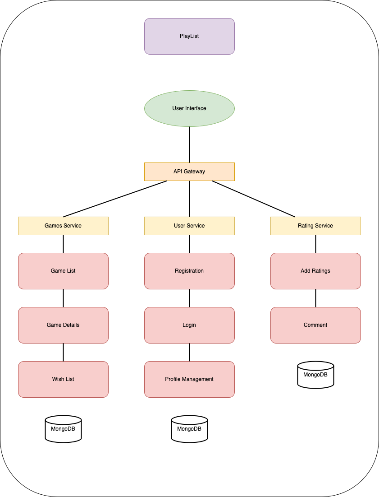

# **PlayList 🎮**

## 📌 **Project Description**

**PlayList** is a platform designed for gamers to **discover, track, and review video games**. It enables users to maintain a list of games they want to play, rate games they have played, and read reviews from other gamers.

## 🎯 **Business Problem**

**Problem:** Gamers often struggle to keep track of the games they want to play, remember which games they have already played, and find reliable reviews.

**Solution:** PlayList offers a simple yet effective platform where users can:

- Add games to their **Wish List** for future reference.
- Rate and review games they have played.
- Browse and search for game details.
- Read reviews and ratings from other players.

**Target Audience:**

- Gamers who want to track their gaming journey.
- Individuals looking for game recommendations based on reviews.
- Communities and friends who want to share gaming experiences.

---

## 🏠 **System Architecture**

The system follows a **microservices architecture** and includes the following core services:

1. **Games Service (`/games`)** - Uses **gRPC** and MongoDB.

   - Stores information about games (title, genre, release date, developer, platform).
   - Allows users to browse and retrieve game details.
   - Supports **Wish List management** (adding/removing games).

2. **Users Service (`/users`)** - Uses **REST API** and MongoDB.

   - Handles user account management (registration, login, authentication).
   - Stores user profile information.

3. **Ratings & Comments Service (`/ratings`)** - Uses **Message Broker** and MongoDB.

   - Allows users to **rate games** (1-10 scale).
   - Enables commenting and discussion on games.
   - Stores and retrieves user-generated ratings and comments.

4. **User Interface (`/ui`)** - A **web application** that serves as the main user interaction layer.
   - Displays game lists and details.
   - Allows users to **add games to their Wish List**.
   - Enables rating and reviewing of games.

---

## 🔗 **Service Communication Flow**

- **Users interact** with the system through the **web interface**.
- **The API Gateway** routes requests to appropriate microservices.
- **Games Service** provides game-related data and wish list management through **gRPC**.
- **Users Service** manages user authentication and profiles through **REST API**.
- **Ratings & Comments Service** processes user reviews via **Message Broker**.
- **MongoDB** is used for storing all application data.

---

## 📂 **Additional Documentation**

- [Games Service](GameService/README.md)
- [Users Service](UserService/README.md)
- [Ratings & Comments Service](RatingService/README.md)
- [User Interface](UserInterface/README.md)

---

## 📌 **System Diagram**

